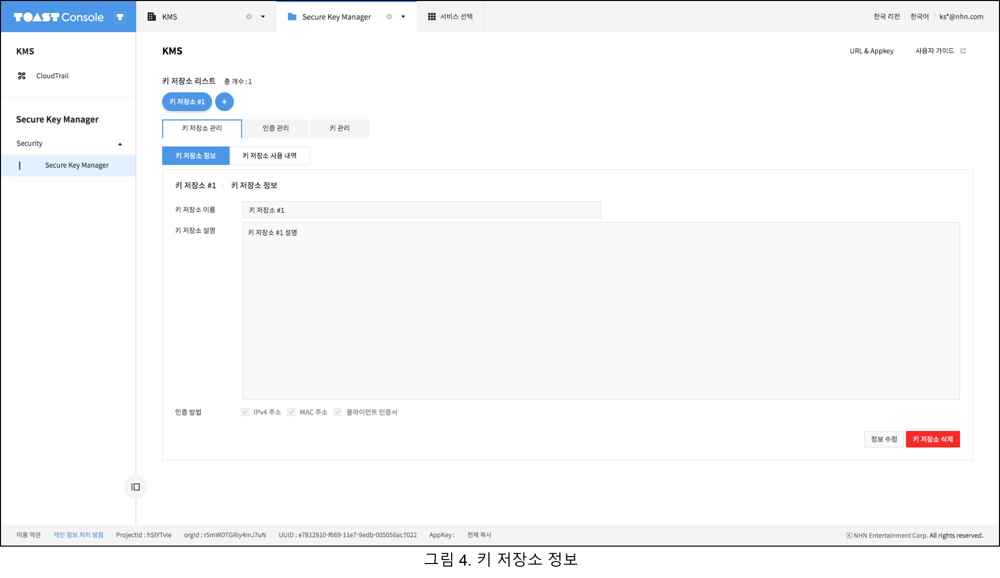
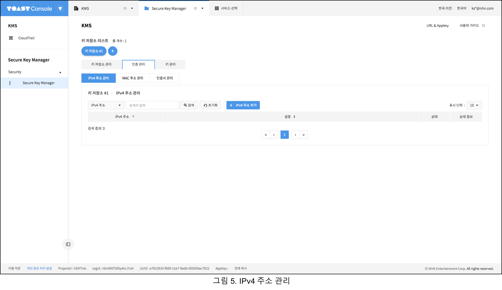
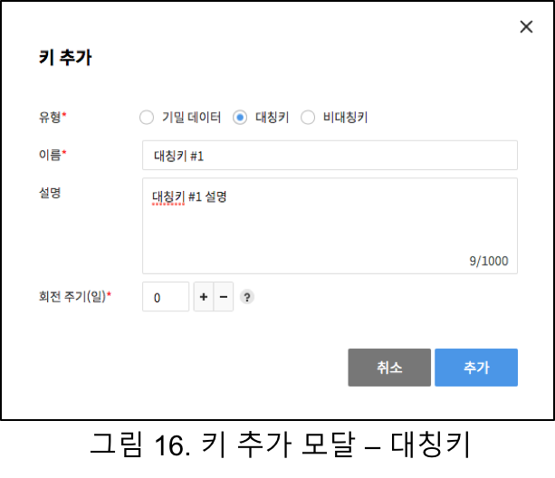
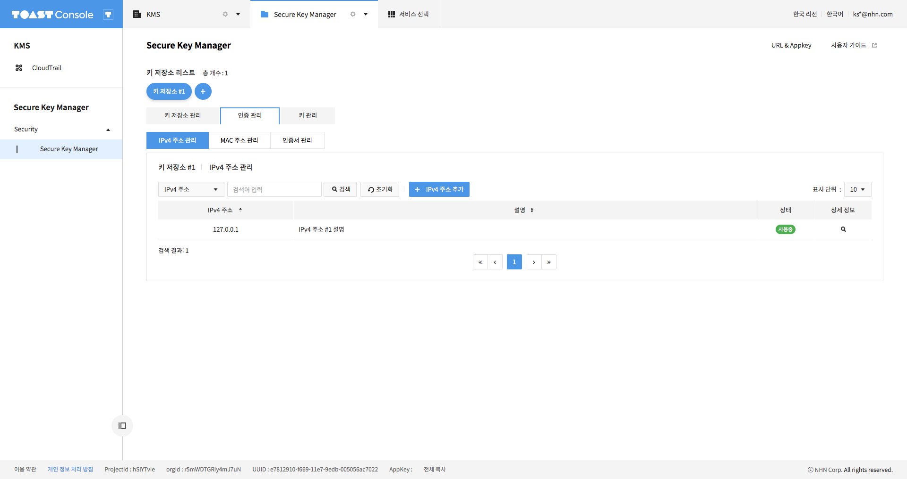
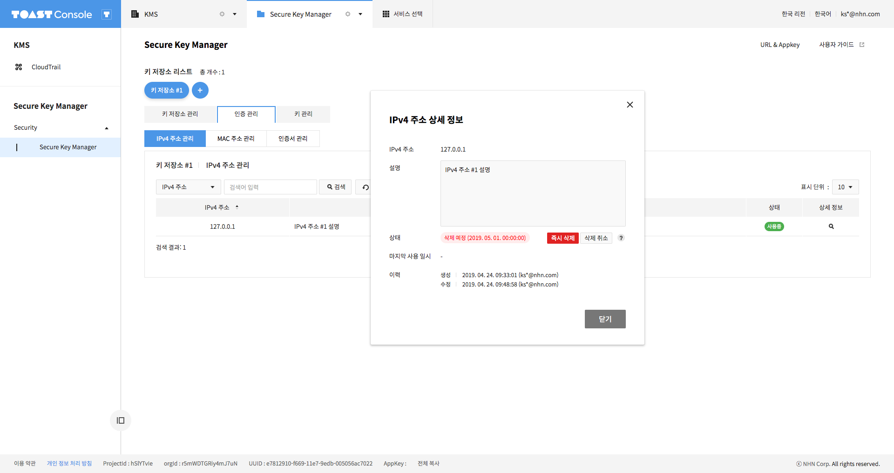
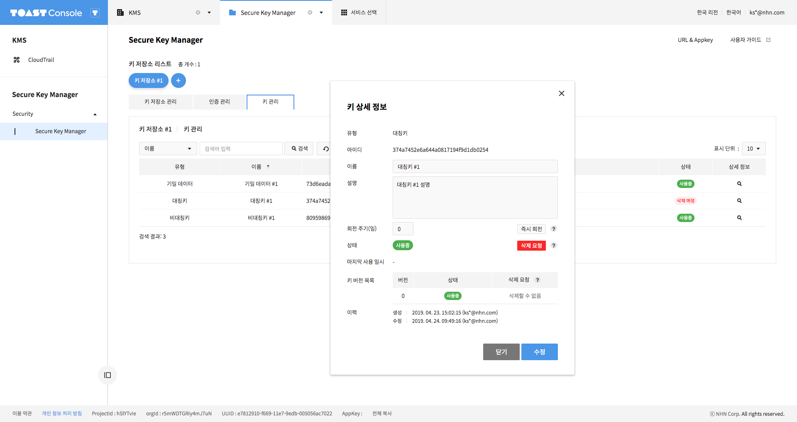
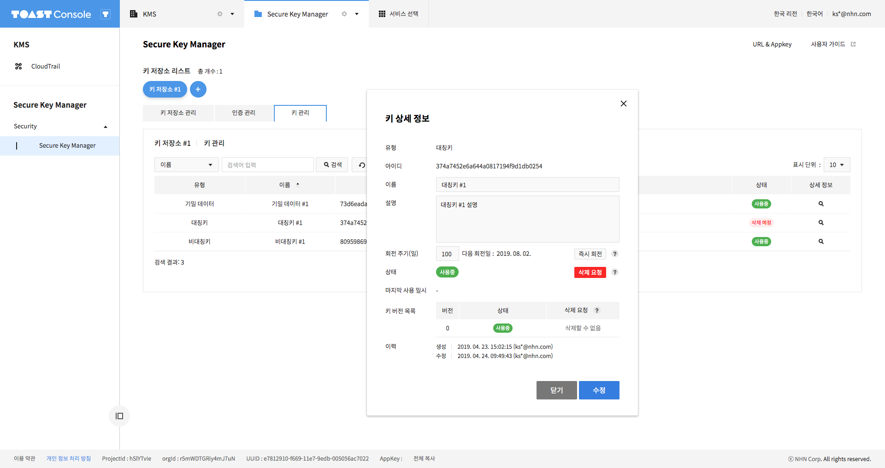

## Security > Secure Key Manager > コンソール使用ガイド

コンソール使用ガイドでは、Secure Key Managerを使用するための基本的な内容を説明します。
* 鍵保存場所の作成
* 認証情報の登録
* 鍵の作成
* ユーザーデータの管理

### 鍵保存場所の作成
Secure Key Managerは、鍵保存場所の単位として認証情報と鍵を管理します。作成した鍵保存場所がない場合、図1のような画面が表示されます。

**鍵保存場所の追加**をクリックすると、図2のように**鍵保存場所の追加**ウィンドウが表示されます。

名前と説明を入力し、1つ以上の認証方法を選択した後に**追加**をクリックすると、鍵保存場所を作成できます。鍵保存場所を作成すると、図3のように鍵保存場所リストを確認できます。

鍵保存場所リストの**+ボタン**は、新しい鍵保存場所を追加する時に使用します。作成した鍵保存場所の名前をクリックすると、図4のように選択した鍵保存場所を管理できる画面が表示されます。

### 認証情報の登録
Secure Key Managerで管理する鍵は、認証をパスしたクライアントのみ使用できます。クライアント認証に使用する認証情報は、**認証管理**メニューの認証方法別下位メニューで登録できます。

#### IPv4アドレスの登録
**認証管理**メニューで**IPv4アドレス管理**をクリックすると、図5のようにIPv4アドレス管理画面が表示されます。

**IPv4アドレス追加**をクリックすると、図6のように**IPv4アドレス追加**ウィンドウが表示されます。

クライアントIPv4アドレスと説明を入力した後、**追加**をクリックして認証情報を登録できます。この時、IPv4アドレスはクライアントがSecure Key Managerサーバーに接続する時に使用するIPv4アドレスを入力する必要があります。登録した認証情報は、図7のように**IPv4アドレス管理**画面で確認できます。

#### MACアドレスの登録
**認証管理**メニューで**MACアドレス管理**をクリックすると、図8のようにMACアドレス管理画面が表示されます。

**MACアドレス追加**をクリックすると、図9のように**MACアドレス追加**ウィンドウが表示されます。

クライアントMACアドレスと説明を入力した後、**追加**をクリックして認証情報を登録できます。登録した認証情報は、図10のように**MACアドレス管理**画面で確認できます。

#### クライアント証明書の登録
**認証管理**メニューで**証明書管理**をクリックすると、図11のように証明書管理画面が表示されます。

**証明書追加**をクリックすると、図12のように**証明書追加**ウィンドウが表示されます。

証明書の名前、パスワード、説明を入力し、使用期間を選択した後**追加**をクリックしてクライアント証明書を作成できます。作成した証明書は、図13のように証明書管理画面で確認できます。証明書管理画面の**ダウンロード**列でアイコンをクリックすると、証明書ファイルをダウンロードできます。

### 鍵の作成
Secure Key Managerは、鍵を3つのタイプに区分します。機密データは文字列データを保存し、APIを使用した照会機能を提供します。対称鍵はAPIを使用したデータの暗号化/復号機能を提供します。非対称鍵はAPIを使用したデータ署名/検証機能を提供します。ユーザーは使用目的に合った鍵タイプを選択した後、鍵を作成できます。

**鍵管理**メニューをクリックすると、図14のように**鍵管理**画面が表示されます。

鍵管理画面で**鍵追加**をクリックすると、**鍵追加**ウィンドウが表示されます。選択したタイプに応じて図15、図16、図17のように鍵を作成するのに必要なデータを入力できる画面が表示されます。

機密データを選択した場合、名前、説明、データを入力でき、対称鍵/非対称鍵を選択した場合、名前、説明、ローテーション周期を入力できます。必要なデータをすべて入力した後、**追加**をクリックして鍵を作成できます。作成した鍵は図18のように**鍵管理**画面で確認できます。

### ユーザーデータの管理
**認証管理**や**鍵管理**でユーザーが登録したデータ(認証情報、鍵)の詳細情報を確認できます。図19のようなデータリスト画面で**詳細情報**列の虫眼鏡アイコンをクリックすると、図20のような**詳細情報**ウィンドウが表示されます。

**詳細情報**ウィンドウでデータの修正や削除ができます。

#### ユーザーデータの削除

ユーザーがSecure Key Managerに登録したデータは'使用中'状態になります。不要なデータを削除するには、図21のように**詳細情報**ウィンドウで**削除リクエスト**をクリックします。

削除リクエストしたデータは、図22のように'削除予定'状態に変更され、使用できなくなります。削除予定時間は7日後の午前0時で、時間になると自動的に削除します。

削除予定状態のデータは、**即時削除**をクリックして削除予定時間まで待たずにすぐに削除できます。また**削除キャンセル**をクリックして'使用中'状態に変更できます。

#### 対称鍵/非対称鍵自動ローテーション周期設定

Secure Key Managerでは、対称鍵/非対称鍵の鍵自動ローテーション機能を提供します。図23のような対称鍵/非対称鍵の詳細情報ウィンドウで鍵自動ローテーション周期を設定できます。ローテーション周期を0に設定すると、自動ローテーションを使用しません。

図24のように0より大きい値を設定して次のローテーション日を表示すると、ローテーション周期ごとに鍵を自動的にローテーションします。

#### 対称鍵/非対称鍵の即時ローテーション

Secure Key Managerでは、対称鍵/非対称鍵の鍵手動ローテーション機能を提供します。図25のような対称鍵/非対称鍵の詳細情報ウィンドウで**即時ローテーション**をクリックすると、鍵を即時にローテーションします。

鍵をローテーションすると、図26のように鍵バージョンリストに新しいバージョンが追加されたことを確認できます。

