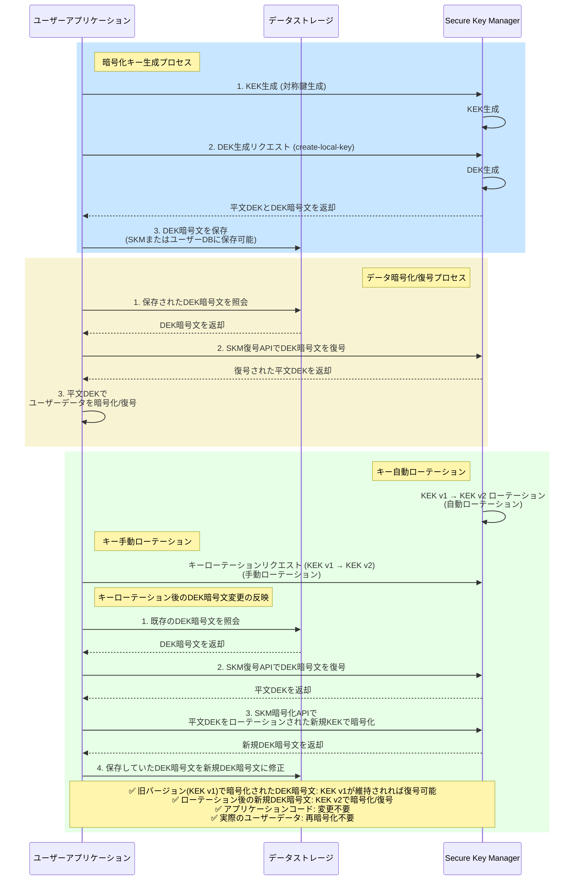

# キーローテーションを利用したセキュリティ強化ガイド
**Security > Secure Key Manager > キーローテーションを利用したセキュリティ強化ガイド**

このガイドでは、Secure Key Manager(SKM)のキーローテーション機能を活用して、実際のサービス環境でセキュリティレベルを向上させる方法について説明します。

!!! tip 「ポイント」
    このガイドは、すでにSecure Key Managerサービスを使用中のユーザーを対象としています。初めて使用する場合は、[Secure Key Managerの概要](./overview)を先に確認してください。

## 用語の整理

このガイドで使用する主要な用語をあらかじめ理解しておくと、内容をより容易に把握できます。

| 用語 | 説明 |
| --- | --- |
| キーローテーション(key rotation) | セキュリティを強化するために、暗号化キーを定期的に新しいキーに交換する作業です。パスワードを定期的に変更するのと同じ概念です。 |
| エンベロープ暗号化(envelope encryption) | データを2段階で暗号化する方法です。重要な書類を封筒に入れ、その封筒をさらに金庫に保管するように、データを二重に保護します。 |
| DEK (data encryption key, データ暗号化キー) | 実際のデータを暗号化するために使用するキーです。エンベロープ暗号化において「封筒」の役割を果たします。 |
| KEK (key encryption key, キー暗号化キー) | DEKを暗号化するために使用するキーです。Secure Key Managerで管理する対称鍵がこの役割を果たします。エンベロープ暗号化において「金庫」の役割を果たします。 |
| キー分割(key segmentation) | 全てのデータを1つのキーで暗号化せず、複数のキーに分けて暗号化する戦略です。時間別、地域別、ユーザーグループ別など、様々な基準で分けることができます。「卵を1つのカゴに盛るな」という格言と同じ原理です。 |

## キーローテーションが必要な理由

暗号化キーを長期間使用する場合、次のようなセキュリティリスクが増加します。

* **キー漏洩リスクの増加**: キーを使用する期間が長くなるほど、攻撃者に漏洩する可能性が高まります。
* **暗号解析攻撃のリスク**: 同一のキーで暗号化されたデータが増えるほど、パターン分析によるキーの推測が容易になります。
* **セキュリティ事故の影響範囲の拡大**: キーが流出した場合、該当キーで暗号化された全てのデータが危険にさらされます。

Secure Key Managerのキーローテーション機能を使用すると、キーIDを変更せずにキー値のみを更新できるため、アプリケーションコードを修正することなくセキュリティを強化できます。

## キーローテーション戦略の策定

キーローテーション戦略は、サービスのビジネス影響度とセキュリティ要件に応じて適切に策定する必要があります。

### 考慮事項

* **サービス影響度**: キーローテーションがサービスに及ぼす影響を最小化できる戦略を策定します。
* **運用複雑度**: 自動ローテーション周期の設定及び再暗号化戦略など、運用可能な範囲を考慮します。

!!! tip 「ポイント」
    最小30日から自動ローテーション周期を設定できます。

## エンベロープ暗号化環境でのキーローテーション

エンベロープ暗号化(envelope encryption)は、キーローテーションを効率的に実装できる暗号化パターンです。

### エンベロープ暗号化とは？

エンベロープ暗号化は、データを2段階で暗号化する方法です。一般的な暗号化方式とどのように異なるか比較してみましょう。

#### 一般的な暗号化方式

```
[ユーザーデータ] → [暗号化キーで直接暗号化] → [暗号化されたデータ] (DB保存)
```

この方式の問題点は、キーが流出すると全てのデータが危険にさらされ、キーを変更するには全てのデータを再暗号化する必要があることです。

#### エンベロープ暗号化方式

```
[ユーザーデータ] → [DEKで暗号化] → [暗号化されたデータ]   (DB保存)
[DEK] → [KEKで暗号化] → [DEK暗号文]            (KEKはSecure Key Managerに保存、DEK暗号文はDBまたはSecure Key Managerに保存)
```

エンベロープ暗号化は、一般的な暗号化方式に比べて次のようなセキュリティ上の利点があります。

* **キー漏洩範囲の最小化**: KEKはSecure Key Managerで安全に保管され、ユーザーのコードに含まれません。
* **キー管理の集中化**: 重要なKEKはSecure Key Managerで一元管理され、DEKはデータごとに個別に生成できるため、被害範囲を最小化できます。
* **監査追跡の強化**: Secure Key Managerが全てのKEK使用履歴を記録するため、キー使用に対する監査追跡が容易です。

#### 比喩での理解

マンションの玄関の暗証番号を定期的に変更しなければならない状況を考えてみましょう。

* **一般方式**: 玄関ドア(データ)に直接暗証番号(キー)を設定しておく → 暗証番号を変えるには、100世帯のドアの暗証番号を全て再設定しなければならない
* **エンベロープ方式**: 玄関ドア(データ)は固定された鍵(DEK)でロックし、鍵は小さな保管箱に入れて暗証番号(KEK)で保管 → 暗証番号を変えるには、保管箱の暗証番号だけ変更すればよい

### エンベロープ暗号化がキーローテーションに有利な理由

#### 従来の単一キー暗号化の問題点

* 単一キーで直接全てのデータを暗号化すると、キーローテーション時に全データを再暗号化する必要があります。
* 100万件のデータがある場合、キーローテーション時に100万件全てで再暗号化が必要です。

#### エンベロープ暗号化による解決方法

* **2段階暗号化構造**: データはDEK(data encryption key)で暗号化し、DEKのみKEK(key encryption key)で暗号化します。
* **KEKローテーションの利点**: KEKをローテーションしても実際のユーザーデータはそのままであり、DEK暗号文のみ処理すれば済みます。
* **旧バージョンの互換性**: Secure Key Managerは複数バージョンのKEKを同時に管理するため、旧バージョンのKEKで暗号化されたDEK暗号文も自動的に復号できます。

#### 実際の効果

```
単一キー方式
キーローテーション時 → 100万件のデータの再暗号化が必要(非常に長い時間がかかる)

エンベロープ暗号化方式
キーローテーション時 → 実際のユーザーデータはそのまま、再暗号化不要
         → DEK暗号文のみ新しいKEKバージョンで再暗号化
         → アプリケーションコードを変更することなく、自動的に新しいKEKバージョンを使用
```

このような構造のおかげで、エンベロープ暗号化は**キーローテーションの運用負担を最小化**しつつ、**セキュリティレベルを維持**できます。

### エンベロープ暗号化の実装例

エンベロープ暗号化形式でSecure Key Managerを利用する場合、次のようなフローにすることを推奨します。


<details>
<summary><span>Mermaid chart</span></summary>



</details>

!!! danger "注意"
    キーが必要な全てのリクエストに対してSecure Key Manager APIを直接呼び出すと、レスポンス遅延が発生する可能性があります。パフォーマンス最適化のため、適切にキャッシュして使用してください。

## キー分割戦略による被害範囲の最小化

全データを単一キーで暗号化する場合、キー流出時に全てのデータが危険にさらされます。これを防ぐために、キー分割(key segmentation)戦略を使用して被害範囲を最小化できます。

### 1. キー分割の必要性

#### 単一キー使用時の問題点

```
[全顧客データ100万件]
    ↓
[単一DEKで暗号化]
    ↓
キー流出時 → 100万件全てが危険にさらされる
```

#### キー分割適用時

```
[顧客データ100万件]
    ↓
[地域別/期間別/顧客ランク別に複数のDEKを使用]
    ↓
DEK 1個流出時 → 10万件のみ危険にさらされる(被害90%減少)
```

### 2. キー分割戦略のタイプ

#### A. 時間ベースの分割(time-based segmentation)

データ生成時点に応じて異なるキーを使用する方式です。

**実装方法**

1. データ生成時点(年月)別にSecure Key Managerで対称鍵を生成し、自動ローテーションを設定します。
2. アプリケーションで時点別のキーIDマッピング情報を管理します(例: `2026-01 → キーID: abc123...`, `2026-02 → キーID: def456...`)。
3. データ暗号化時、該当月にマッピングされたキーIDと現在のキーバージョンでエンベロープ暗号化を実行します。
4. 暗号化されたデータとともに、使用したキーIDとキーバージョン情報を保存します(例: `keyId: abc123..., version: 0`)。
5. 復号時には、保存されたキーIDとバージョン情報を使用してデータを復号します。

!!! tip 「ポイント」
    Secure Key Managerのキーは、UUID形式のキーIDと0から始まるバージョンで管理されます。キーローテーション時にバージョンが0 → 1 → 2と増加するため、どのバージョンで暗号化したかをアプリケーションで必ず記録する必要があります。

**メリット**

* キー流出時、該当期間のデータのみ影響を受ける
* 古いデータはキーの削除により完全なデータ破棄が可能
* 規制遵守: データ保管期間満了時、キーの削除により暗号学的に破棄可能

**適用例**

```
2026年1月データ: キーID abc123...(10万件)
2026年2月データ: キーID def456...(10万件)
2026年3月データ: キーID ghi789...(10万件)

→ 1月のキー(abc123...)流出時: 1月のデータ10万件のみ影響
```

#### B. ユーザーグループベースの分割(user group segmentation)

ユーザー属性に応じて異なるキーを使用する方式です。

**実装方法**

**方法 1: ハッシュベースの分割**

1. Secure Key Managerで複数の対称鍵を生成します(例: 10個)。

!!! tip 「ポイント」
    ハッシュ関数は、入力値を固定長の固有値に変換する関数です。同じ入力値は常に同じ結果を生成するため、ユーザーごとに一貫したキーを割り当てることができます。

2. ユーザーIDをハッシュ関数で変換し、ハッシュ値をキーの個数で割った余りを求めてキー番号を決定します(例: 0～9)。
3. アプリケーションでキー番号別のキーIDマッピング情報を管理します(例: `0 → キーID: abc123...`, `1 → キーID: def456...`)。
4. 暗号化されたデータとともに、使用したキーIDとキーバージョン情報を保存します。
5. 復号時には、保存されたキーIDとバージョン情報を使用してデータを復号します。

**方法 2: 顧客ランク別の分割**

1. 顧客ランク別にSecure Key Managerで対称鍵を生成します(例: VIP用、PREMIUM用、STANDARD用)。
2. アプリケーションで顧客ランク別のキーIDマッピング情報を管理します(例: `VIP → キーID: abc123...`, `PREMIUM → キーID: def456...`)。
3. 暗号化されたデータとともに、使用したキーIDとキーバージョン情報を保存します。
4. 復号時には、保存されたキーIDとバージョン情報を使用してデータを復号します。

**メリット**

* ユーザーグループごとのセキュリティポリシーの差別化適用が可能
* 特定のユーザーグループキー流出時、他のグループデータは安全
* 顧客ランクごとのキーローテーション周期の差別化(VIP: 30日、一般: 90日)

### 3. キー分割の運用シナリオ

**シナリオ: 100万人の顧客データを10個のキーに分割**

```
初期状態
- 10個のキーID(abc123..., def456..., ghi789... 等)、各10万件ずつデータを保有
- 各キーごとに独立して管理

事故発生
→ キーID ghi789... 流出の疑い

対応措置
1. キーID ghi789... 即時ローテーション
2. 該当キーで暗号化された10万件のデータのみ再暗号化
3. 他の9個のキーは影響なし

結果
✅ 被害範囲: 10万件(全体の10%)
✅ 再暗号化時間: 約1時間(全体再暗号化時10時間 → 90%削減)
✅ サービス影響: 最小化
```

### 4. キー分割時の注意事項

#### A. キー管理の複雑化

分割されたキーが増えるほど管理が複雑になります。

**キーリストの追跡方法**

1. Secure Key Manager APIを使用して、現在有効な全てのキーリストを照会します。
2. アプリケーションのキーマッピングテーブルを基準にグループ化します(例: 時間別、サービス別、顧客ランク別)。
3. 各キーIDについて、データベースで暗号化されたデータ数を照会します。
4. キーごとの生成日、次回ローテーション予定日、使用データ数を定期的に監査します。

#### B. 古いキーの整理ポリシー

使用していないキーを整理するポリシーが必要です。生成されてから一定期間が経過したキーを照会し、該当キーで暗号化されたデータがない場合は削除対象に分類し、定期的に整理作業を行います。

### 5. キー分割戦略選択のヒント

初めて導入する場合は、**時間ベースの分割(月別)**から始めることを推奨します。サービス規模が拡大しデータが重要になったら、**ハッシュベースの分割**を追加で適用してセキュリティを強化できます。

## 自動キーローテーション設定

### 1. コンソールでの自動ローテーション有効化

**ステップ別設定方法**

1. Secure Key Managerコンソールでキーストアを選択します。
2. **キー管理**メニューをクリックします。
3. ローテーションする対称鍵または非対称鍵を選択します。
4. 詳細情報ウィンドウで**自動ローテーション周期**を設定します。


### 2. 自動ローテーションの動作方式

* 設定した周期が到来すると**自動的に新しいキーバージョンを生成**
* 既存のキーIDは維持され、キーバージョンのみ増加(0 → 1 → 2 ...)
* **最新バージョンが自動的に基本キーとして設定**され、暗号化に使用される
* 旧バージョンのキーは復号用途で継続して使用可能

!!! danger "注意"
    * ローテーション周期を「0」に設定すると、自動ローテーションが無効になります。
    * 最小ローテーション周期は30日です。

## 手動キーローテーション運用

自動ローテーション以外に、次のような状況では即時の手動ローテーションが必要です。

### 1. 緊急キーローテーションが必要な場合

* KEK流出の疑いがある場合
* DEK暗号文流出の疑いがある場合
* 退職者など内部の人員変動が発生した場合
* セキュリティ脆弱性が発見された場合
* システム侵入検知時

!!! danger "注意"
    平文DEKがメモリやアプリケーションレベルで流出した場合、キーローテーションだけでは不十分です。すでに流出した平文キーで暗号化されたデータは依然として復号可能であるため、必ずデータの再暗号化(re-encryption)を併せて実行する必要があります。

### 2. 即時ローテーション実行方法

1. キーストアで対象キーを選択します。
2. **キー詳細情報**ウィンドウで**即時ローテーション**をクリックします。


3. ローテーション完了後、キーバージョンリストで新しいバージョンを確認します。


### 3. APIによるキーローテーションのモニタリング

キーローテーション後の変更事項をAPIで確認できます。

```bash
curl -X GET \
  'https://api-keymanager.nhncloudservice.com/keymanager/v1.2/appkey/{appkey}/keystores/{keyStoreId}/keys/{keyId}' \
  -H 'X-TC-AUTHENTICATION-ID: {User Access Key ID}' \
  -H 'X-TC-AUTHENTICATION-SECRET: {Secret Access Key}'
```

**レスポンス例**

```json
{
  "header": {
    "resultCode": 0,
    "resultMessage": "success",
    "isSuccessful": true
  },
  "body": {
    "keyId": "035a0ffa16a64bbf8171c4bdcea37bbf",
    ...中略...
    "currentKeyValueVersion": 2,
    "autoRotationPeriod": 0,
    "nextAutoRotationDate": null,
    ...後略...
  }
}
```

## 注意事項

### キーローテーション適用前の留意事項

現在、Secure Key Managerの対称鍵を**データを直接暗号化する用途**で使用している場合、**キーローテーションを適用する前に必ずエンベロープ暗号化へ切り替える**必要があります。

#### 単一キーでデータを直接暗号化している場合

```
ユーザーデータ → Secure Key Managerの対称鍵で直接暗号化 → 暗号化されたデータを保存
```

この状態でキーローテーションを適用すると、次のような問題が発生します。

1. キーバージョンが0 → 1に変更される
2. 既存データは以前のキーバージョンで暗号化されているが、新しいキーバージョンで復号を試みることになる
3. 全ての既存データの復号に失敗 → サービス全体の障害

#### 安全な適用方法

**方法 1: エンベロープ暗号化への移行(推奨)**

1. エンベロープ暗号化構造にシステムを再設計します。
2. 既存データを新しい構造に移行します。
3. 移行完了後、キーローテーションを適用します。

**方法 2: 現在の構造を維持(非推奨)**

単一キー暗号化を維持したままキーローテーションを適用する場合、次のような問題が発生します。

* キーローテーションのたびに**全データを再暗号化**する必要がある
* 大量データの場合、再暗号化に数十時間かかる
* 再暗号化中にサービス中断またはパフォーマンス低下が発生

#### チェックリスト

キーローテーション適用前に必ず以下の事項を確認してください。

* [ ] 現在、エンベロープ暗号化方式を使用しているか？
* [ ] キーIDとキーバージョン情報をデータとともに保存しているか？
* [ ] テスト環境でキーローテーションのシナリオを検証したか？
* [ ] キーローテーション後、既存データの復号が正常に動作することを確認したか？

!!! danger "注意"
    本番環境にキーローテーションを適用する前に、必ずテスト環境でシナリオ全体を検証する必要があります。一度のミスで大きな障害が発生する可能性があります。

## 結論

高まるセキュリティ要件に対応するため、このガイドではSecure Key Managerのキーローテーション機能を活用した2つのセキュリティ強化戦略を紹介しました。サービス環境とデータ特性に応じて、次のように必須または選択的に適用できます。

### 推奨適用方式

#### 1. エンベロープ暗号化(必須)

エンベロープ暗号化は、キーローテーションの基本となるパターンです。単一キーで直接データを暗号化する方式よりキーローテーションがはるかに容易で、大量のデータを再暗号化する必要がありません。最初のシステム設計時からエンベロープ暗号化方式を適用することを強く推奨します。

#### 2. キー分割(選択)

キー分割は、セキュリティレベルをさらに一段階高める戦略です。ただし、管理の複雑さが増すため、サービス特性に応じて選択的に適用できます。

* **適用時のメリット**: 個人情報や金融データなど機密情報の保護強化、キー流出時の被害範囲の最小化
* **適用時の考慮事項**: 管理の複雑化、キーの追跡及び整理ポリシーが必要

### 期待効果

Secure Key Managerのキーローテーション機能を適切に活用することで、次のような効果を得ることができます。

* アプリケーションコードを変更することなくセキュリティレベルを向上
* 自動化されたキー管理による運用負担の軽減
* セキュリティコンプライアンス要件への準拠
* セキュリティ事故発生時の被害範囲の最小化

キーローテーションは一回限りの作業ではなく、継続的なセキュリティプロセスです。サービス規模とセキュリティ要件に合わせて戦略を選択し、定期的な検討と改善を通じてセキュリティレベルを継続的に向上させることができます。

## 参考資料

* [Secure Key Managerコンソールガイド](./console-guide)
* [Secure Key Manager API v1.2ガイド](./api-guide-v1.2)
* [対称鍵管理機能を活用したエンベロープ暗号化](./overview/#secure-key-manager)
