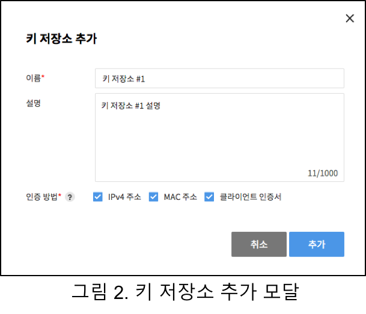
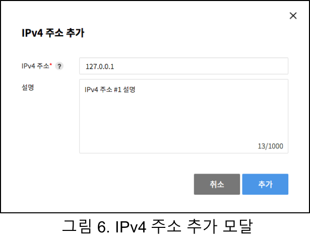
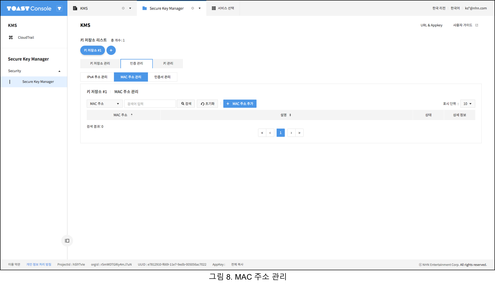
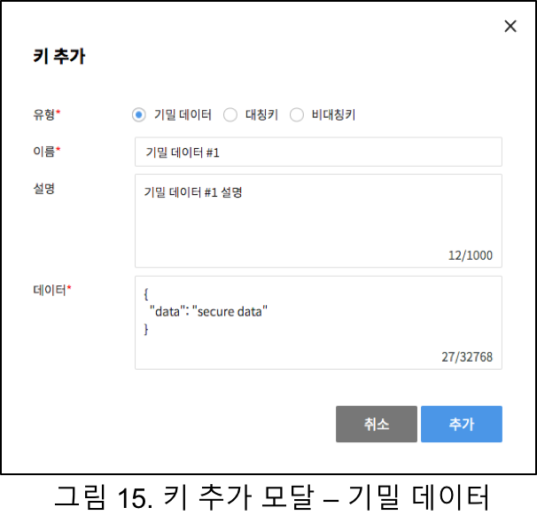
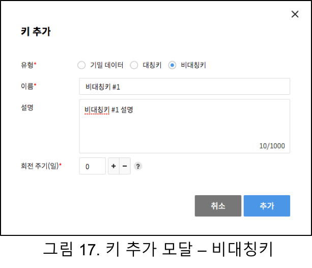
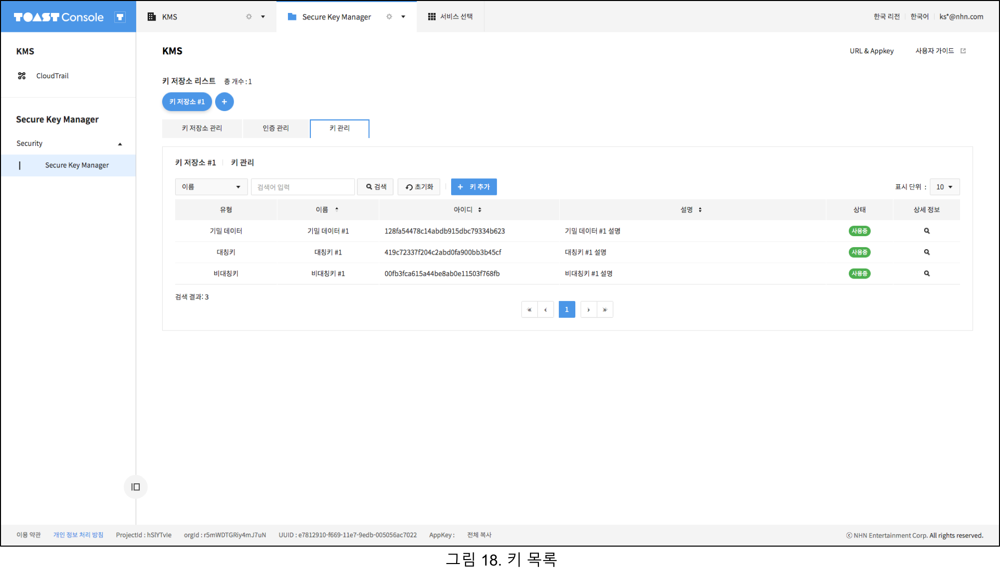
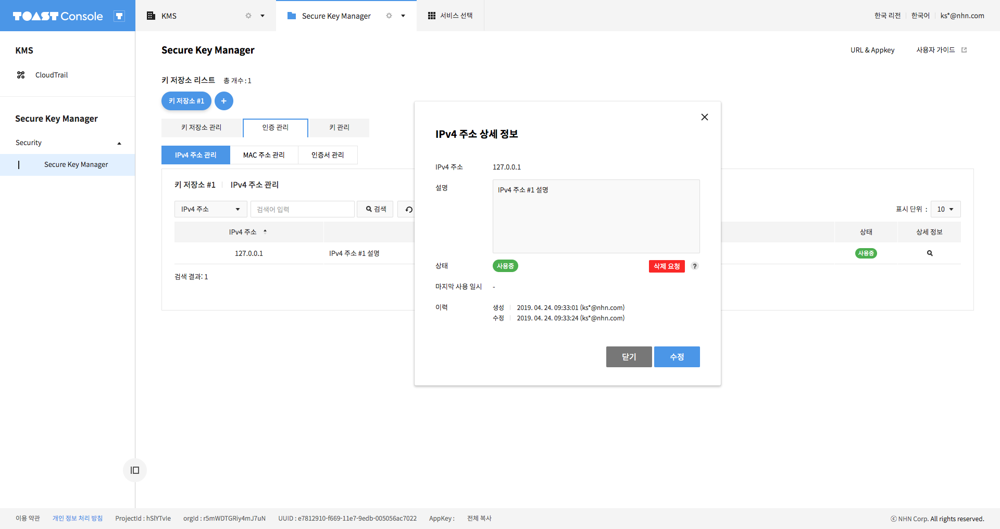

## Security > Secure Key Manager > 콘솔 사용 가이드

콘솔 사용 가이드는 Secure Key Manager를 사용하는데 필요한 기본적인 내용을 설명합니다.
* 키 저장소 생성
* 인증 정보 등록
* 키 생성
* 사용자 데이터 관리

### 키 저장소 생성
Secure Key Manager는 키 저장소 단위로 인증 정보와 키를 관리합니다. 생성한 키 저장소가 없을 경우 그림 1과 같이 화면을 표시합니다.

[키 저장소 추가]를 클릭해서 그림 2와 같이 키 저장소 추가 모달을 실행할 수 있습니다.

이름과 설명을 입력하고 한개 이상의 인증 방법을 선택한 후 [추가]를 클릭하면 키 저장소를 생성할 수 있습니다. 키 저장소를 생성하면 그림3과 같이 키 저장소 목록을 확인할 수 있습니다.

키 저장소 목록의 [+]는 새로운 키 저장소를 추가할때 사용합니다. [생성한 키 저장소 이름]을 클릭하면 그림 4와 같이 선택한 키 저장소를 관리할 수 있는 화면을 표시합니다.

### 인증 정보 등록
Secure Key Manager에서 관리하는 키는 인증을 통과한 클라이언트만 사용할 수 있습니다. 클라이언트 인증에 사용하는 인증 정보는 인증 관리 메뉴의 인증 방법별 하위 메뉴에서 등록할 수 있습니다.

#### IPv4 주소 등록
인증 관리 메뉴에서 [IPv4 주소 관리]를 클릭하면 그림 5와 같이 IPv4 주소 관리 화면을 표시합니다.

[IPv4 주소 추가]를 클릭해서 그림 6과 같이 IPv4 주소 추가 모달을 실행할 수 있습니다.

클라이언트 IPv4 주소와 설명을 입력한 후 [추가]를 클릭해서 인증 정보를 등록할 수 있습니다. 이때 IPv4 주소는 클라이언트가 Secure Key Manager 서버에 접속할 때 사용하는 IPv4 주소를 입력해야 합니다. 등록한 인증 정보는 그림 7과 같이 IPv4 주소 관리 화면에서 확인할 수 있습니다.

#### MAC 주소 등록
인증 관리 메뉴에서 [MAC 주소 관리]를 클릭하면 그림 8과 같이 MAC 주소 관리 화면을 표시합니다.

[MAC 주소 추가]를 클릭해서 그림 9와 같이 MAC 주소 추가 모달을 실행할 수 있습니다.

클라이언트 MAC 주소와 설명을 입력한 후 [추가]를 클릭해서 인증 정보를 등록할 수 있습니다. 등록한 인증 정보는 그림 10과 같이 MAC 주소 관리 화면에서 확인할 수 있습니다.

#### 클라이언트 인증서 등록
인증 관리 메뉴에서 [인증서 관리]를 클릭하면 그림 11과 같이 인증서 관리 화면을 표시합니다.

[인증서 추가]를 클릭해서 그림 12와 같이 인증서 추가 모달을 실행할 수 있습니다.

인증서 이름, 비밀번호, 설명을 입력하고 사용 기간을 선택한 후 [추가]를 클릭해서 클라이언트 인증서를 생성할 수 있습니다. 생성한 인증서는 그림 13과 같이 인증서 관리 화면에서 확인할 수 있습니다. 인증서 관리 화면의 [다운로드 아이콘]을 클릭하면 인증서 파일을 다운로드 할 수 있습니다.

### 키 생성
Secure Key Manager는 키를 3가지 유형으로 구분합니다. 기밀 데이터는 문자열 데이터를 저장하고 API를 사용한 조회 기능을 제공합니다. 대칭키는 API를 사용한 데이터 암/복호화 기능을 제공합니다. 비대칭키는 API를 사용한 데이터 서명/검증 기능을 제공합니다. 사용자는 사용 목적에 맞는 키 유형을 선택한 후 키를 생성할 수 있습니다.

[키 관리] 메뉴를 클릭하면 그림 14와 같이 키 관리 화면을 표시합니다. 키 관리 화면에서 [키 추가]를 클릭해서 키 추가 모달을 실행할 수 있습니다. 선택한 유형에 따라 그림 15, 그림 16, 그림 17과 같이 키를 생성하는데 필요한 데이터를 입력할 수 있는 화면을 표시합니다.

기밀 데이터를 선택한 경우 이름, 설명, 데이터를 입력할 수 있고 대칭키/비대칭키를 선택한 경우 이름, 설명, 회전 주기를 입력할 수 있습니다. 필요한 데이터를 모두 입력한 후 [추가]를 클릭해서 키를 생성할 수 있습니다. 생성한 키는 그림 18과 같이 키 관리 화면에서 확인할 수 있습니다.

### 사용자 데이터 관리
인증 관리나 키 관리에서 사용자가 등록한 데이터(인증 정보, 키)는 상세 정보 조회 기능을 제공합니다. 그림 19와 같은 데이터 목록 화면에서 [상세 조회 아이콘]을 클릭하면 그림 20과 같은 상세 정보 모달을 실행할 수 있습니다.

사용자는 상세 정보 모달에서 데이터를 수정하거나 삭제할 수 있습니다.

#### 사용자 데이터 삭제

사용자가 Secure Key Manager에 등록한 데이터는 사용중 상태를 가집니다. 사용자는 불필요한 데이터를 삭제하기 위해 그림 21과 같은 상세 정보 모달에서 [삭제 요청]을 클릭해서 삭제를 요청할 수 있습니다.

삭제 요청한 데이터는 그림 22와 같이 삭제 예정 상태로 변경되며 즉시 사용할 수 없게 됩니다. 삭제 예정 시간은 7일 후 자정으로 설정하며 시간이 지나면 자동으로 삭제합니다.

삭제 예정 상태의 데이터는 [즉시 삭제]를 클릭해서 삭제 예정 시간까지 기다리지 않고 바로 삭제하거나, [삭제 취소]를 클릭해서 사용중 상태로 변경할 수 있습니다.

#### 대칭키/비대칭키 자동 회전 주기 설정

Secure Key Manager는 대칭키/비대칭키에 대한 키 자동 회전 기능을 제공합니다. 그림 23과 같은 대칭키/비대칭키 상세 정보 모달에서 키 자동 회전 주기를 설정할 수 있습니다. 회전 주기를 0으로 설정하면 자동 회전을 사용하지 않습니다.

그림 24와 같이 0 보다 큰 값을 설정하면 다음 회전 일을 표시하면, 회전 주기마다 키를 자동으로 회전합니다.

#### 대칭키/비대칭키 즉시 회전

Secure Key Manager는 대칭키/비대칭키에 대한 키 수동 회전 기능을 제공합니다. 그림 25과 같은 대칭키/비대칭키 상세 정보 모달에서 [즉시 회전]을 클릭하면 키를 즉시 회전합니다.

키를 회전하면 그림 26과 같이 키 버전 목록에 새로운 버전이 추가된 것을 확인할 수 있습니다.

