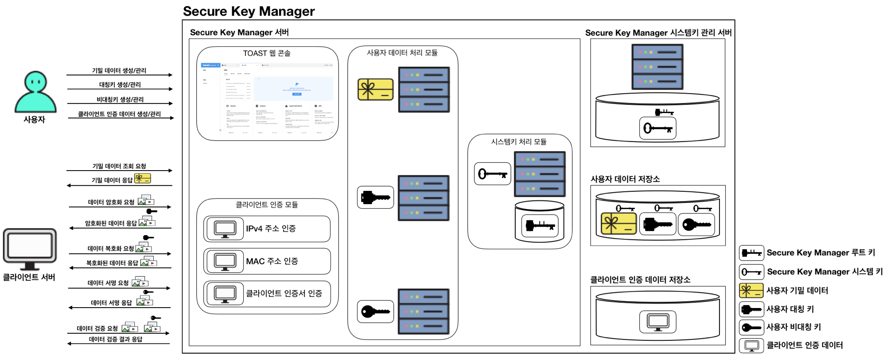

## Security > KMS > 개요
KMS(Key Management Service)는 사용자의 중요 데이터를 안전하게 보관하고 접근 권한을 제어하는 서비스입니다. 사용자는 KMS에 기밀 데이터, 대칭키, 비대칭키를 저장할 수 있습니다. KMS에 저장한 데이터는 사용자가 설정한 인증 방법을 통과한 클라이언트만 접근할 수 있습니다.

### 주요 기능
* 데이터 관리
    * 기밀 데이터 등록, 관리, 조회
    * 대칭키 생성, 관리, 회전, 데이터 암/복호화
    * 비대칭키 생성, 관리, 회전, 데이터 서명/검증
* 데이터 접근 제어
    * 클라이언트 IPv4 주소를 사용한 데이터 접근 제어
    * 클라이언트 MAC 주소를 사용한 데이터 접근 제어
    * 클라이언트 인증서를 사용한 데이터 접근 제어

### 기능 설명
KMS는 사용자의 중요 데이터를 안정하게 보관하고 접근 권한을 제어하는 기능을 제공합니다. KMS로 관리할 수 있는 데이터는 기밀 데이터, 대칭키, 비대칭키로 구분할 수 있습니다.

#### 기밀 데이터 관리
기밀 데이터 관리는 데이터베이스 접속 정보, API 호출에 사용하는 AppKey 등 클라이언트가 직접 관리할 경우 보안 위험에 노출될 수 있는 데이터를 관리하는 기능을 제공합니다. 사용자는 32KB 이하의 텍스트 데이터를 기밀 데이터로 등록할 수 있습니다. 등록한 기밀 데이터에는 사용자가 설정한 인증 방법을 통과한 클라이언트만 접근할 수 있습니다. 기밀 데이터 관리의 활용 방안은 "참고 - KMS 기밀 데이터 관리를 활용한 데이터베이스 접속 정보 관리"를 참고하시기 바랍니다.

#### 대칭키 관리
대칭키 관리는 데이터 암/복호화에 사용할 수 있는 사용자 대칭키를 관리하는 기능을 제공합니다. 사용자는 KMS에 사용자 대칭키를 생성하고 저장할 수 있습니다. 사용자가 설정한 인증 방법을 통과한 클라이언트는 KMS에 저장한 사용자 대칭키를 사용해서 32KB 이하의 텍스트 데이터를 암/복호화 할 수 있습니다. 사용자 대칭키는 어떠한 경우에도 클라이언트에 직접 노출되지 않고, API를 통한 간접적인 사용만 허용합니다. 이로 인해 사용자 대칭키가 외부로 노출되는 위험으로부터 보호할 수 있습니다. 또한 KMS의 키 회전 기능을 사용하면 클라이언트를 변경하지 않고 사용자 대칭키 값을 갱신할 수 있습니다. 대칭키 관리의 활용 방안은 - "참고 - KMS 대칭키 관리를 활용한 봉투 암호화"를 참고하시기 바랍니다.

#### 비대칭키 관리
비대칭키 관리는 데이터 서명/검증에 사용할 수 있는 사용자 비대칭키를 관리하는 기능을 제공합니다. 사용자는 KMS에 사용자 비대칭키를 생성하고 저장할 수 있습니다. 사용자가 설정한 인증 방법을 통과한 클라이언트는 KMS에 저장한 사용자 비대칭키를 사용해서 4KB 이하의 텍스트 데이터를 서명/검증할 수 있습니다. 사용자 비대칭키는 어떠한 경우에도 클라이언트에 직접 노출되지 않고, API를 통한 간접적인 사용만 허용합니다. 이로 인해 사용자 비대칭키가 외부로 노출되는 위험으로부터 보호할 수 있습니다. 또한 KMS의 키 회전 기능을 사용하면 클라이언트를 변경하지 않고 사용자 비대칭키 값을 갱신할 수 있습니다.

#### 접근 제어
KMS는 사용자 데이터를 보호하기 위한 다양한 인증 방법을 제공합니다. 사용자가 설정한 인증 방법을 통과한 클라이언트만 KMS에 저장한 데이터를 사용할 수 있습니다. 인증 방법은 클라이언트의 IPv4 주소를 확인하는 IPv4 주소 인증, 클라이언트의 MAC 주소를 확인하는 MAC 주소 인증, 클라이언트가 통신에 사용하는 인증서를 확인하는 클라이언트 인증서 인증으로 구분합니다. 사용자는 최소 한 개 이상의 인증 방법을 선택해야 하며, 두 개 이상을 선택한 경우 클라이언트는 모든 인증을 통과해야 합니다.

### 서비스 구조
KMS는 사용자 데이터를 안전하게 보관하기 위해 루트키와 시스템키라는 두 개의 암호키를 내부적으로 사용합니다. 루트키는 시스템키를 보호하기 위한 목적으로 사용하며 시스템키는 사용자 데이터를 보호하기 위한 목적으로 사용합니다. 시스템키는 루트키로 암호화해서 KMS 시스템키 관리 서버에 저장합니다. KMS 서버는 서비스를 시작할 때 인증 과정을 거쳐서 KMS 시스템키 관리 서버로부터 암호화된 시스템키를 가져옵니다. 루트키를 사용해서 복호화하면 시스템키 처리 모듈이 시스템키를 사용할 수 있는 상태가 됩니다. KMS에 저장한 사용자 데이터를 비정상적인 방법으로 접근하려면 물리적으로 분리된 세 개의 시스템에서 루트키, 시스템키, 사용자 데이터를 모두 획득해야 합니다.

사용자는 TOAST 웹 콘솔에서 KMS를 관리할 수 있습니다. 웹 콘솔은 사용자 데이터 생성/관리, 클라이언트 인증 데이터 생성/관리 등의 기능을 제공합니다. KMS에서 생성한 모든 사용자 데이터는 시스템키로 암호화해서 사용자 데이터 저장소에 저장합니다. 클라이언트 인증 데이터는 일부 중요 정보를 시스템키로 암호화해서 클라이언트 인증 데이터 저장소에 저장합니다.

KMS는 클라이언트 서버에서 사용할 수 있는 다양한 API를 제공합니다. 클라이언트 서버는 기밀 데이터 조회, 대창키를 사용한 암/복호화, 비대칭키를 사용한 서명/검증을 요청할 수 있습니다. 클라이언트 인증 모듈은 클라이언트 인증 데이터를 사용해서 클라이언트의 요청을 허가할지 결정합니다. 클라이언트의 요청이 허가되면 사용자 데이터 처리 모듈은 시스템키 처리 모듈을 사용해서 암호화된 사용자 데이터를 복호화한 후 서비스를 제공합니다.

### 참고

#### KMS 기밀 데이터 관리를 활용한 데이터베이스 접속 정보 관리
데이터베이스를 사용하는 애플리케이션은 데이터베이스 접속 정보를 설정 파일에 저장합니다. 애플리케이션을 실행하는 서버가 증가하면 데이터베이스 접속 정보를 저장하는 서버가 증가하고, 데이터베이스 접속 정보가 노출될 위험도 함께 증가합니다. 또한 데이터베이스 접속 정보를 변경하면 설정을 수정한 후 전체 서버에 재배포를 해야 하는 불편함이 있습니다.
KMS 기밀 데이터 관리 기능을 활용하면 데이터베이스 접속 정보를 중앙 집중적으로 안전하게 관리할 수 있습니다. 데이터베이스 접속이 필요한 애플리케이션은 서비스를 시작할 때 KMS에서 데이터베이스 접속 정보를 가져와서 사용합니다. 사용자는 KMS를 통해서 데이터베이스 접근을 허용할 애플리케이션 서버를 관리할 수 있습니다. 데이터베이스 접속 정보를 변경해도 애플리케이션을 수정할 필요 없이 KMS에서 접속 정보를 갱신할 수 있습니다.

#### KMS 대칭키 관리를 활용한 봉투 암호화
KMS는 데이터를 암/복호화 할 수 있는 대칭키 관리 기능을 제공합니다. 애플리케이션은 KMS API를 사용해서 원하는 데이터를 암/복호화 할 수 있습니다. 그러나 애플리케이션이 처리하는 모든 데이터를 KMS API로 암/복호화 하면 성능 및 비용 문제가 발생할 수 있습니다. 이러한 상황에서 일반적으로 사용하는 해결책은 봉투 암호화 기법입니다. 봉투 암호화는 암호화 대상 데이터를 암호화 할 때 사용한 암호키만 외부의 다른 암호키로 보호하는 처리 방식입니다. 데이터는 애플리케이션이 자체적으로 관리하는 로컬 암호키를 사용해서 암호화하고, 로컬 암호키는 KMS API로 암호화해서 보관합니다. 데이터 복호화가 필요하면 암호화된 로컬 암호키를 KMS API로 복호화해서 데이터 복호화에 사용합니다.

#### 용어 설명
| 용어 | 설명 |
|---|---|
| 키 저장소 | 사용자 데이터를 저장하고 인증 방법을 설정하는 단위 |
| 키 | KMS에서 관리하는 사용자 데이터(기밀 데이터, 대칭키, 비대칭키) |
| 인증 방법 | KMS에 저장한 사용자 데이터에 클라이언트가 접근할 수 있는지 판단하는 방법 |
| 인증 데이터 | KMS에 저장한 사용자 데이터에 접근을 허용하는 클라이언트 정보 |
| 키 회전 | 대칭키와 비대칭키의 키 아이디를 유지한 채로 키값만 갱신하는 작업 |
| 키 버전 | 대칭키와 비대칭키의 키 회전이 발생할 때마다 증가하는 값 |
